# ELK-Stack-Project
Project 1 - ELK Stack Project

## Automated ELK Stack Deployment

The files in this repository were used to configure the network depicted below.

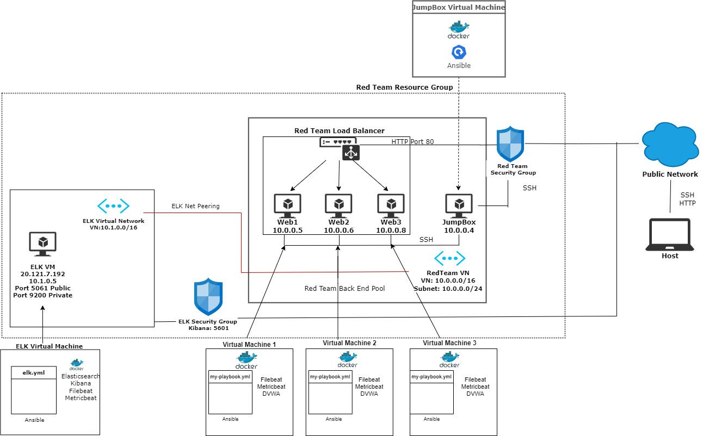

These files have been tested and used to generate a live ELK deployment on Azure. They can be used to either recreate the entire deployment pictured above. Alternatively, select portions of the YAML file may be used to install only certain pieces of it, such as Filebeat.

  - _elk.yml._

This document contains the following details:
- Description of the Topologu
- Access Policies
- ELK Configuration
  - Beats in Use
  - Machines Being Monitored
- How to Use the Ansible Build

### Description of the Topology

The main purpose of this network is to expose a load-balanced and monitored instance of DVWA, the D*mn Vulnerable Web Application.

Load balancing ensures that the application will be highly available, in addition to restricting inbound access to the network.
- _The load balancers prevent any unauthorized traffic reaching the application._
- _The advantage of the jumpbox is that they add a layer of security to the web servers and keep it from being exposed to the public._

Integrating an ELK server allows users to easily monitor the vulnerable VMs for changes to the filesystem and system performance.
- _The filebeat watches for any log data._
- _The Metricbeat records the metric data from target servers._

The configuration details of each machine may be found below.

| Name     | Function | IP Address | Operating System    |
|----------|----------|------------|---------------------|
| Jump Box | Gateway  | 10.0.0.4   | Linux (ubuntu 18.04)|
| Web 1    |Webserver | 10.0.0.5   | Linux (ubuntu 18.04)|
| Web 2    |Webserver | 10.0.0.6   | Linux (ubuntu 18.04)|
| Web 3    |Webserver | 10.0.0.8   | Linux (ubuntu 18.04)|
| ELK VM   |Elk       | 10.1.0.5   | Linux (ubuntu 18.04)|

### Access Policies

The machines on the internal network are not exposed to the public Internet. 

Only the _____ machine can accept connections from the Internet. Access to this machine is only allowed from the following IP addresses:
- _104.42.155.0_

Machines within the network can only be accessed by _____.
- _The machine that will allow me access will be the JumpBox VM. _
- _Public IP: 104.42.155.0_
- _Private IP: 10.1.0.5_

A summary of the access policies in place can be found in the table below.

| Name     | Publicly Accessible   | Allowed IP Addresses   |
|----------|-----------------------|------------------------|
| Jump Box | Yes                   | 104.42.155.0           |
| Web 1    | No                    | RedTeamLB 13.64.62.16  |
| Web 2    | No                    | RedTeamLB 13.64.62.16  |
| Web 3    | No                    | RedTeamLB 13.64.62.16  |
| ELK VM   | Yes with Kibana (HTTP)| 20.121.7.192:5601      |

### Elk Configuration

Ansible was used to automate configuration of the ELK machine. No configuration was performed manually, which is advantageous because...
- _You are able to create and edit the configurations to each of the virtual machines that are associated with it. _

The playbook implements the following tasks:
- _Install docker.io – installs the docker code to the server_
- _Install pip3 – it facilitates by allowing supplementary docker modules to be installed_
- _Install docker python module – allows PIP to install the docker component modules_
- _Use more memory – in order to increase the memory, this will allow the server to increase its memory_
- _Download and launch a docker elk container – downloads the ELK docker container and allows the ports to be established_

The following screenshot displays the result of running `docker ps` after successfully configuring the ELK instance.

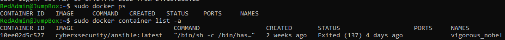

### Target Machines & Beats
This ELK server is configured to monitor the following machines:
- _10.0.0.4_ 
- _10.0.0.5_  
- _10.0.0.6_  
- _10.0.0.8_
- _10.1.0.5_

We have installed the following Beats on these machines:
- _Filebeat and metricbeat were installed on Web 1, Web 2, Web 3, and ELK._

These Beats allow us to collect the following information from each machine:
- _Filebeats monitors log data and will forward those logs to Elasticserach or Logstash to be indexed._
- _Metricbeat monitors for any information in the file system that has been compromised._

### Using the Playbook
In order to use the playbook, you will need to have an Ansible control node already configured. Assuming you have such a control node provisioned: 

SSH into the control node and follow the steps below:
- Copy the _____ file to _____.
- Update the _____ file to include...
- Run the playbook, and navigate to ____ to check that the installation worked as expected.

Answer the following questions to fill in the blanks:
- _Copy the elk.yml to /etc/ansible/elk.yml_
- _Update the host file to include ELK VM private IP_ 
-_Run the playbook and navigate to http://20.121.7.192:5601/app/kibana to check that the installation worked as expected_ 

Which file do you update to make Ansible run the playbook on a specific machine? How do I specify which machine to install the ELK server on versus which to install Filebeat on?
- _To run the playbook on a specific machine use ansible-playbook /etc/ansible/elk.yml_
- _To install Filebeat on a specific machine: curl   https://gist.githubusercontent.com/slape/5cc350109583af6cbe577bbcc0710c93/raw/eca603b72586fbe148c11f9c87bf96a63cb25760/Filebeat >> /etc/ansible/filebeat-config.yml_
- _nano filebeat-config.yml_
- _Under output.elasticserach change the IP address to your ELK VM private IP address with port 9200_
- _Under setup.kibana change to the IP address to your ELK VM private IP address with port 5601_

Which URL do you navigate to in order to check that the ELK server is running?
- _http://20.121.7.192:5601/app/kibana_

### Kibana Web Log Data

Add the sample web log data to Kibana.

Answer the following questions:

In the last 7 days, how many unique visitors were located in India?

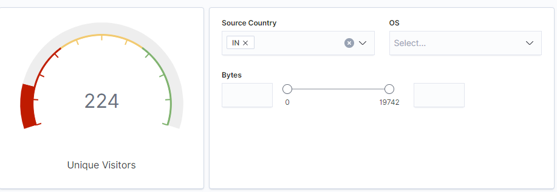

- _224_

In the last 24 hours, of the visitors from China, how many were using Mac OSX?

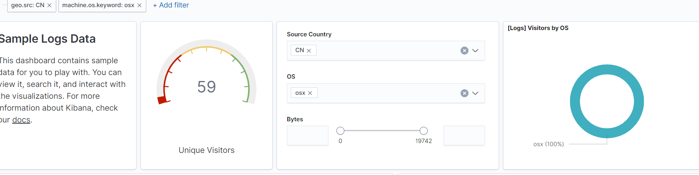

- _59_

In the last 2 days, what percentage of visitors received 404 errors? How about 503 errors?

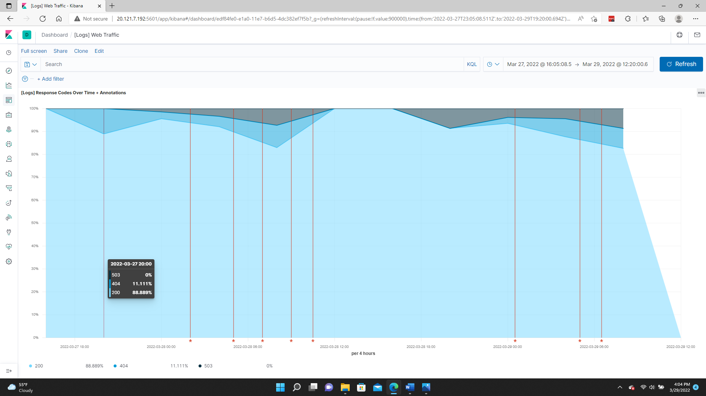

- _404: 11.111%_
- _503: 0%_

In the last 7 days, what country produced the majority of the traffic on the website?

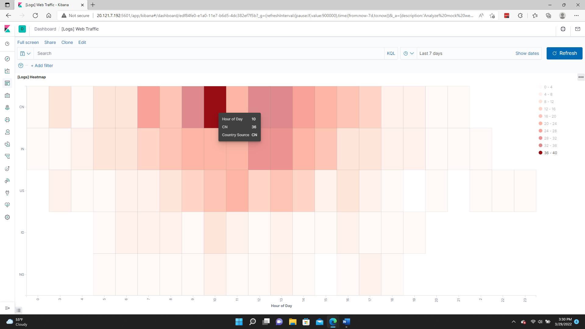

- _ China produced the most traffic

Of the traffic that's coming from that country, what time of day had the highest amount of activity?
- _ The time of day that had the most traffic was 9:00 am - 10:00 am

List all the types of downloaded files that have been identified for the last 7 days, along with a short description of each file type (use Google if you aren't sure about a particular file type)

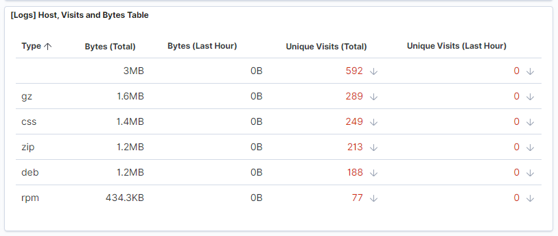

- _gz:  These files are compressed files and can be opened with GNU zip._ 
- _css: These files are used to formaout the layout of an entire website._
- _zip: These files do not take much storage space and can compress one or more files together._
- _deb: This file is a  Debian Software Package file and is used to install apps on Linux._
- _rpm: This file is a Red Hat Software Package file and it stores installation packages on Linux._

Locate the time frame in the last 7 days with the most amount of bytes (activity).

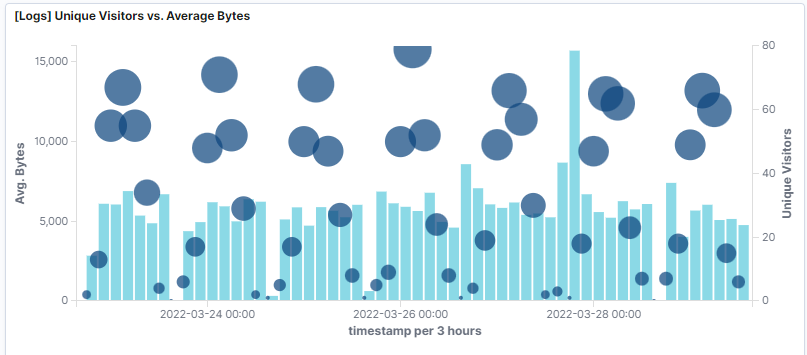

In your own words, is there anything that seems potentially strange about this activity?

- _On March 28th, it looks like there is one vistor that is using a unusual amount of bytes compared to all of the other usages._  

What is the timestamp for this event?

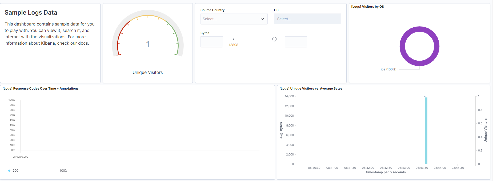

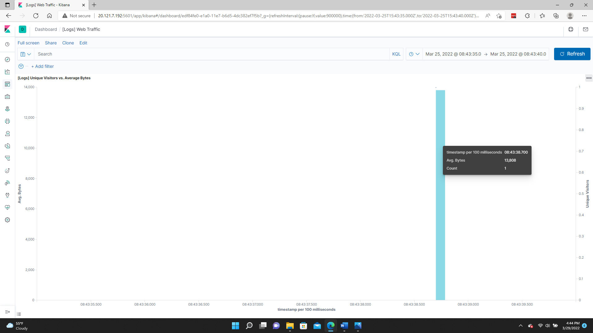

What kind of file was downloaded?

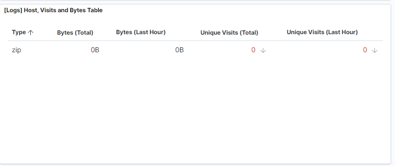

- _A zip file_

From what country did this activity originate?

- _India_

What HTTP response codes were encountered by this visitor?

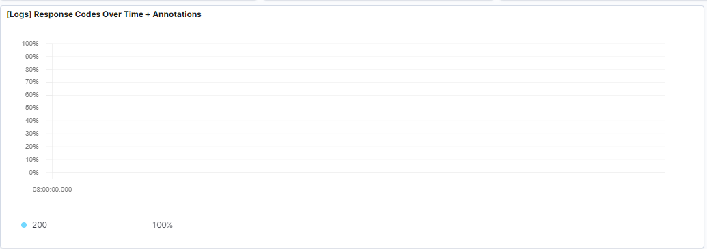

- _200 OK_

What is the source IP address of this activity?

- _184.167.34.105_
-
What are the geo coordinates of this activity?
- _{"lat": 36.38559583, "lon": -97.27721083}_

What OS was the source machine running?

- _ios_

What is the full URL that was accessed?

- _https://artifacts.elastic.co/downloads/apm-server/apm-server-6.3.2-windows-x86.zip_

From what website did the visitor's traffic originate?

- _Facebook_

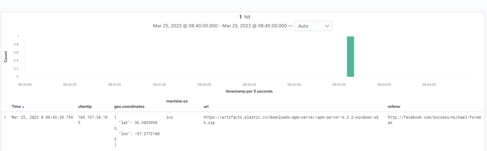

What do you think the user was doing?

- _Downloading a Linux package

Was the file they downloaded malicious? If not, what is the file used for?

- _I do not believe that it's malicious. The file maybe to install or update a file.

Is there anything that seems suspicious about this activity?
Is any of the traffic you inspected potentially outside of compliance guidlines?

- _ What was suspicious was the referral link was from Facebook.
- _ I believe that it might not be in compliance due to the fact that it came from Facebook.

